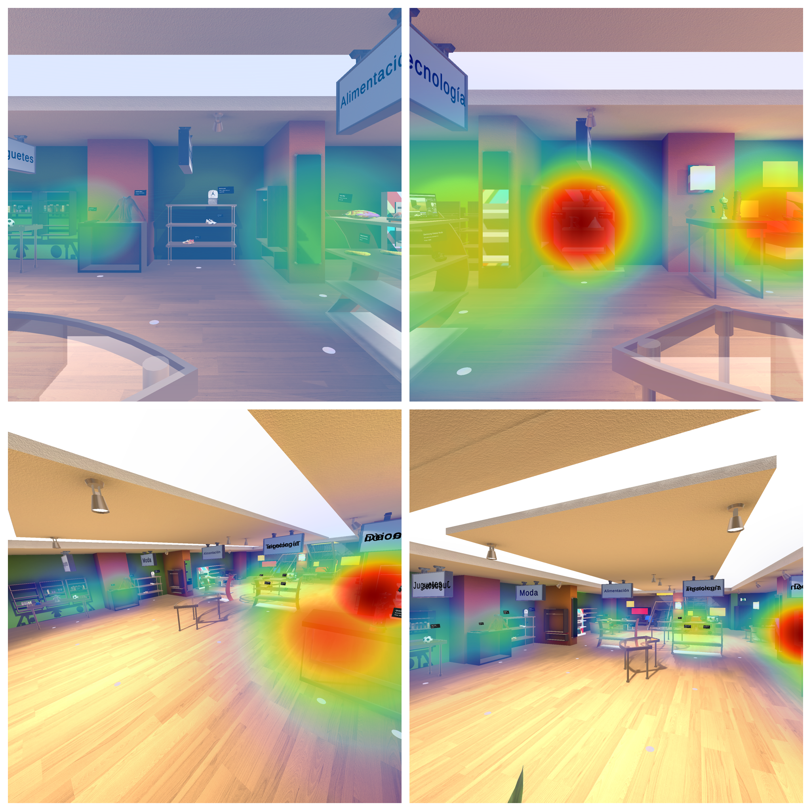

  

# Description
The VRSI framework is comprised of three distinct components: i) *retail environment setup* *component*, ii) *data collection component*, and iii) *behaviour statistics component*. The next Figure shows, from a general perspective, the architecture that supports the VRSI framework and manifests the relationships between these components.

The *retail environment setup component* allows developers and researchers to configure the virtual space. Its main responsibility is to enable data collection and provide users interaction capabilities with the environment and products. Besides that, the *data collection component* is responsible for recording user activity data during the shopping experience. Finally, the *behaviour statistics component* provides a tool for obtaining statistics and data derived from the data collected by the *data collection component*. The objective of this last layer is to offer a set of statistics, based on metrics proposed in previous works in the literature, to help understand user behaviour in each session. Among these, we can mention those based on eye-tracking, user positional data and hand data, navigation in the immersive environment, and user interactions with it.

Overall, the proposed software not only provides the recording of raw data so that any researcher has the freedom to process it as they see fit, but it also offers a general understanding of it. Through Python scripts and the help of libraries like Pandas and Numpy, data processing is performed, allowing it to be structured and analysed in the form of graphs and numerical data based on different features: observation time, number of interactions, hands used, distance travelled, or volumetric heat-maps, among other data.

## Retail environment setup component

This component establishes the foundation for building a VR Shopping application, enabling the configuration of the shopping environment and providing the user with the ability to interact with the whole immersive space.

Regarding environment configuration, this component offers a series of **prefabs** that allow design the 3D scene, starting with the shelves or product exhibitors of the virtual shopping environment. In the literature, the effects of product placement and the arrangement of shelves on potential consumers have been studied . This influences, for example, product placement based on price at a certain height, or enhancing product visibility to boost the number of sales.

The type of shelves chosen will limit both the distribution of displayed products and the areas of interest (AOIs). By linking a script to the desired shelves, three configurable colliders for three heights: *top*, *middle*, and *bottom*, will be added. This allows knowing which specific area of the shelf has been interacted with.

Finally, the *retail environment setup component* allows the selection of two different navigation modes: i) by the user's own movement or ii) combining this with teleportation offered by the Meta SDK. The first mode is feasible if there is enough physical space or if the virtual space is small enough. The second mode allows building larger commercial environments and navigating comfortably without experiencing motion sickness . Additionally, the component provides prefabs that facilitate the inclusion of teleportation zones or points. This allows teleporting the user or enabling proactive teleportation. %Including one of these prefabs in the scene defines an area of interest (ZOI), which can be modified according to the needs of the VRSI user.

**Zones of Interest** (ZOIs) allow obtaining structured information about the user’s shopping experience when in a specific zone of the environment with regards the shelves that contain products \cite{khatri_recognizing_2022}. Furthermore, AOIs define areas at different height levels of each shelf with which the consumer can interact or observe \cite{moghaddasi_segmentation_2020}. The information obtained from the data collected through these features has been used in studies to recognize age and gender, or consumer's compulsivity. ZOIs are significantly useful for understanding user behaviour and the analysis of proposed shopping tasks for case studies.

Moreover, the chosen product distribution is a major aspect for enhancing the user shopping experience . Due to the usefulness of these features for analysing consumer behaviour, VRSI provides the possibility to easily incorporate them into any V-commerce application. Additionally, the sizes of the ZOIs and AOIs can be adjusted to match the dimensions of the shelves and the environment floor used. Regarding AOIs, the script adds the three aforementioned height levels, but it can be modified if the shelf can not be divided in these heights. As for ZOIs, VRSI allows teleportation zones to be marked as such, with the ability to modify their area dimensions. Although optional, VRSI offers the option to segment data by ZOIs based on the user’s position in each frame (see Section \ref{subsec:behavior-statistics}). Based on previous literature , the segmentation of the environment floor into ZOIs is based on four zones: i) the *Shelf* itself, ii) *Adjacent* to the shelf, iii) *Near* the shelf, and iv) *Far* from the shelf.

## Data collection component

This component is responsible for collecting and structuring useful data generated during a V-commerce application session for behavior analysis and consumer identification. The recorded data comes from non-invasive data sources to ensure the user's shopping experience is unaffected. This data is collected passively through the integrated technologies in current headsets and SDKs. Specifically, these data sources are i) *hand tracking*, ii) *head tracking*, iii) *eye tracking*, and iv) *virtual space tracking*. For the latter data source, a series of scripts have been implemented to record data based on events triggered by user interactions with the shopping environment.

The 3D coordinates obtained from the user’s position via **head tracking** are stored in a JSON file, used by the *behavior statistics component* to generate a 3D heat-map. Also stored in a JSON file for generating this heat-map are the collision points representing what a consumer has observed, thanks to Unity's physics engine ray-casting and the VR headset’s eye tracking. These heat-maps help understand the areas where a user has spent the most time or the products or shelves that have caught their attention, with warmer colours indicating higher interest.

In addition to these two JSON files, this component structures the data into nine CSV files distributed as follows:
  - Two files that collect data on the 3D coordinates of the eyes and their rotation. These also contain data derived from **eye tracking**, such as which AOI or product the user is looking at, whether saccades or fixations are being made, and the duration of the fixations.
 - One file that records kinematics data of the head and hands from **head tracking** and **hand tracking**.
 - One file that records interaction data with objects. This data can determine how long a user spends grabbing an object, how long they manipulate it, or when they release it.
- One file that records spatial data of the hands when they are within an AOI.
- Two files that record user navigability data through teleportation and body rotations. These are essential for comfortable use of the environment by users who need to be seated or use a wheelchair.
 - Two files that record shopping activities within the environment; specifically: i) adding or removing products from the shopping cart, ii) interactions with user interface (UI) elements to view product information or perform shopping activities, such as confirming an order.

## Behavior statistics component

In addition to supporting the configuration of the V-commerce environment and collecting and structuring data from non-invasive data sources, the VRSI framework offers a Python-based command-line tool for obtaining reports to analyze user behavior patterns. It also allows for maintaining a user history, with all data collected per session, and generating 3D heatmaps to graphically understand user interests (see the Figure below). Furthermore, VRSI includes a script that enables the generation of images from the volumetric heatmap for preservation between successive executions. The volumetric heatmap can always be viewed and navigated by loading the session's JSON files in the Unity editor.

Based on the CSV files obtained with raw **eye-tracking** data, the component will generate two new CSV files identifying eye fixations and saccades during the session, using the dispersion-threshold identification (I-DT) algorithm for immersive virtual environments proposed by Llanes-Jurado et al. Additionally, the tool allows segmenting the CSV file related to the user's spatial data, dividing the floor plane into ZOIs based on default or user-defined distances, as the distances may vary depending on the virtual environment's configuration. The segmentation is divided into *Shelf*, *Adjacent*, *Near*, and *Far* zones, from closest to farthest from the product displays. Moreover, the script detects the frames in which the user is moving or stationary based on a configurable threshold.

Finally, the behavior statistics component provides an initial analysis by generating three PDF reports that include graphs and statistics, mainly based on data features used in the literature to identify user characteristics based on their behavior in V-commerce environments. These reports are thematically divided into i) eye gaze, ii) interaction, and iii) navigation + positional reports. 

